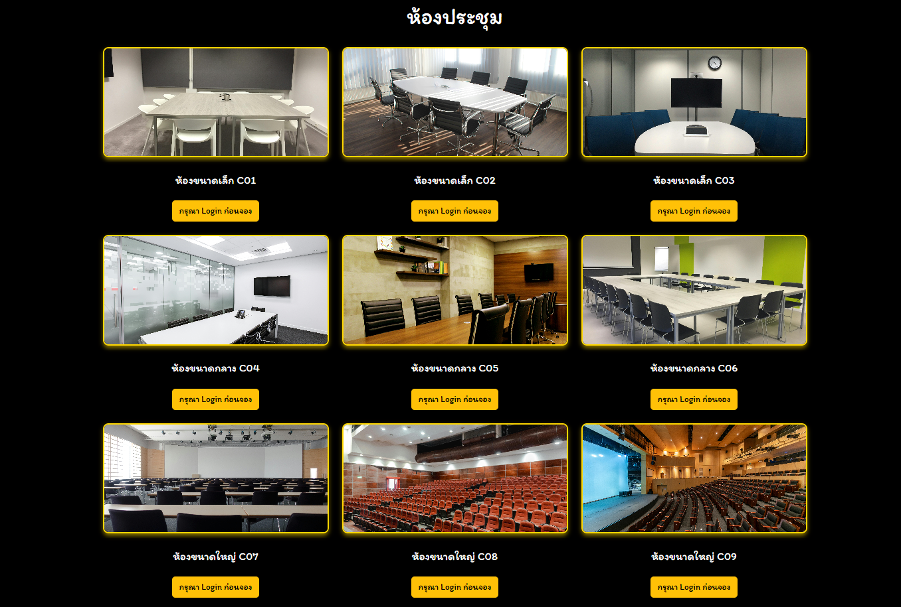
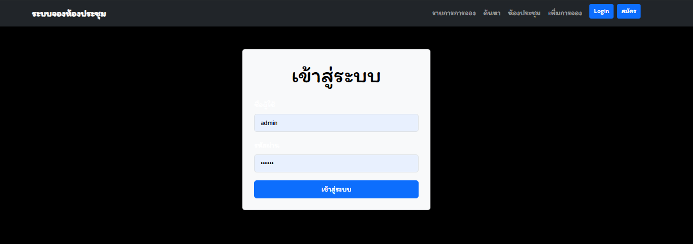
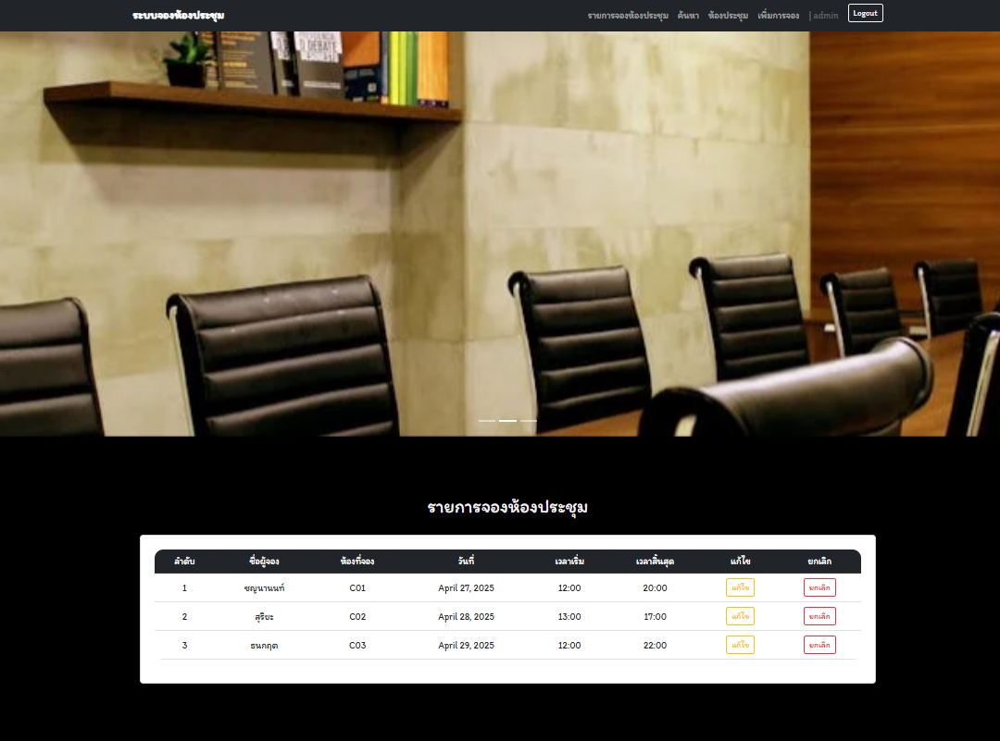
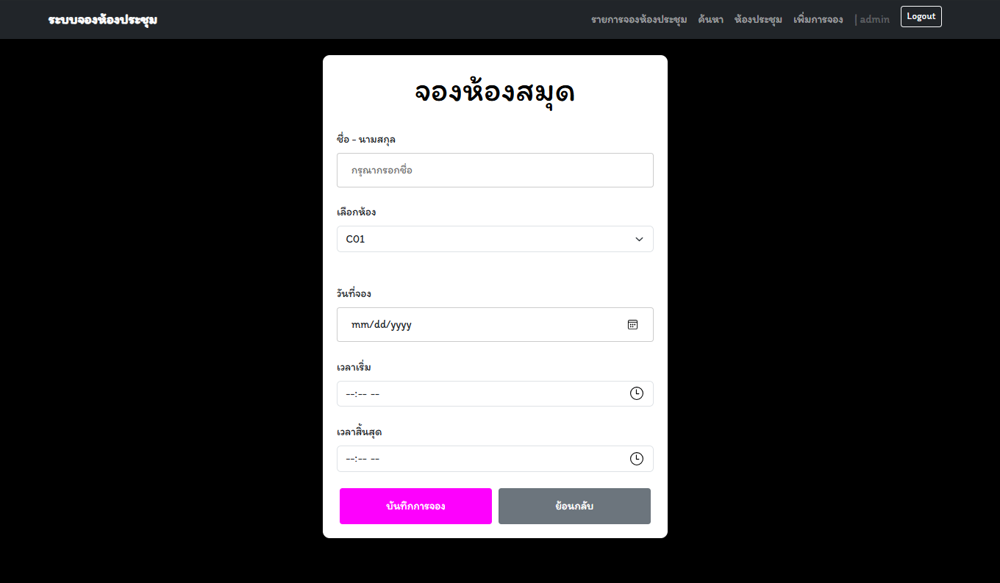

# 🏢 Meeting_Room_Booking_System

> เว็บแอปพลิเคชันสำหรับจองห้องประชุม พร้อมระบบแสดงข้อมูลการจอง ค้นหา แก้ไข และยกเลิกการจองตามสิทธิ์ของผู้ใช้งาน

---

## 🚀 Features
ระบบแสดงข้อมูลการจอง ค้นหา แก้ไข และยกเลิกการจองตามสิทธิ์ของผู้ใช้งานตัวอย่างเว็บ

## 📦 Installation

### 1. Clone โปรเจกต์
```bash
https://github.com/Cannabiscafe67/Project-Meeting-room.git
```
### 2. รัน Development Server
```bash
python manage.py runserver
```
### ก่อนเข้าสู่ระบบ (Guest)

- ❌ ไม่สามารถดูรายละเอียดรายการจองห้องประชุม
- ❌ ไม่สามารถจอง แก้ไข หรือยกเลิกการจอง
- ❌ ไม่สามารถเลือกขนาดห้องประชุมที่ต้องการได้ (ต้องเข้าสู่ระบบก่อน)  
  
- ✅ สามารถค้นหาข้อมูลการจองห้องประชุมได้  
  
- 📝 สมัครสมาชิกเพื่อใช้งานเต็มรูปแบบ  
  

---

### หลังเข้าสู่ระบบหรือสมัครสมาชิก (Authenticated User)

- 🔐 หน้า Login  
  

- ✅ ดูรายละเอียดรายการจองห้องประชุมทั้งหมด  
- 🔁 แก้ไข และยกเลิกการจองได้  
  

- ➕ แบบฟอร์มเพิ่มข้อมูลการจองห้องประชุม  
  

- 🔍 ค้นหาการจองห้องประชุม  
  

- 🏠 เลือกขนาดห้องประชุมที่ต้องการได้  
  

---

## 🛠 Technologies

- Python
- Django
- HTML / CSS / JavaScript
- SQLite (ค่าเริ่มต้นของ Django)

---
